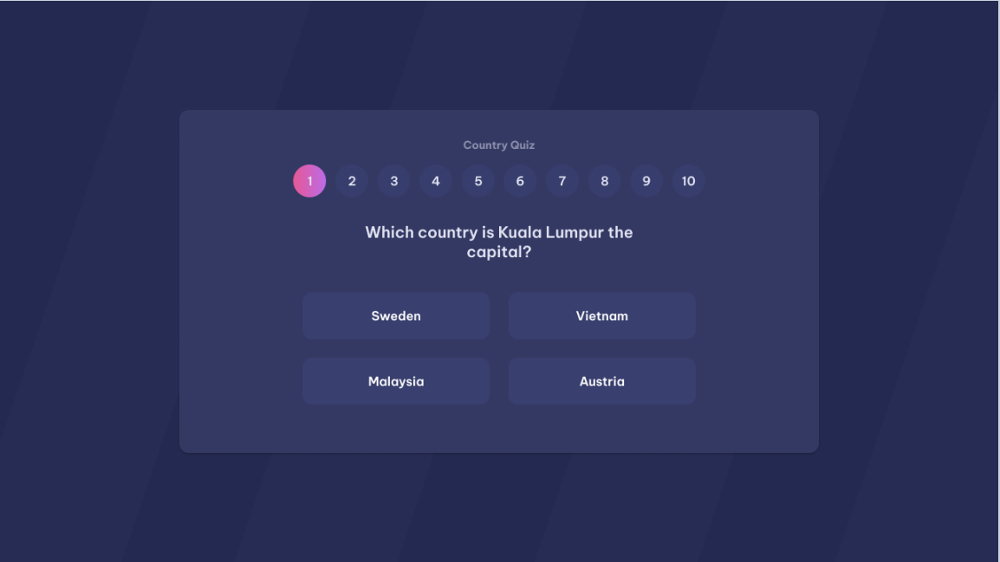
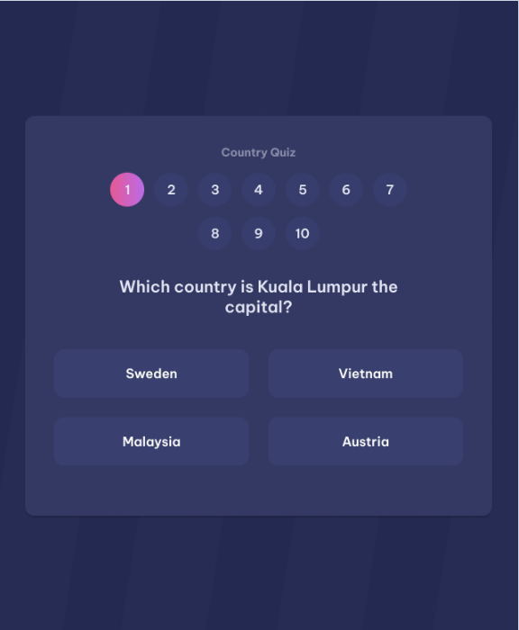

# Country Quiz

Embark on a global quiz adventure! Guess the country in each question, unravel clues, and enjoy the challenge. Ready to explore? Start guessing now!

## Table of contents

- [Overview](#overview)
  - [Links](#links)
  - [The challenge](#the-challenge)
  - [Screenshot](#screenshot)
- [My process](#my-process)
  - [Built with](#built-with)
  - [Useful resources](#useful-resources)
- [Author](#author)

## Overview

Immerse yourself in a global quiz adventure! Engage in the challenge of guessing the country in each question. There are no clues, just pure enjoyment. Are you ready to explore? Start guessing now and embrace the thrill!

### Links

- Solution URL: [CountryQuiz Solution](https://github.com/ioangheraszim/CountryQuiz)
- Live Site URL: [CountryQuiz Live](https://ioangheraszim.github.io/CountryQuiz)

### The challenge

Users should be able to:

- Create a country quiz that matches the given design.

- By default, generate 10 questions about countries with the given API.

- In each question, users should see 4 options.

- When users select an answer, they should get the correct answer immediately with according indicators in the design.

- User can navigate to any questions.

- When users answer all 10 questions, they should see a congratulations page with the result and choose to play again.

- Deploy the solution and submit Repository URL and Demo URL.

## Screenshot

- Desktop Screenshot

  

    
  

- Mobile Screenshot
  

     
  

## My process

### Built with

- Semantic HTML5 markup
- Tailwind CSS
- Mobile-first workflow
- [React](https://reactjs.org/) - JS library

### Useful resources
- [Rest Countries API](https://restcountries.com/) 

*The "restcountries.com" API offers essential country information through a user-friendly RESTful interface. Developers can access details like name, population, capital, and more for seamless integration into applications and projects.*

## Author

- Website - [Ioan Gheraszim](https://github.com/ioangheraszim)
- Portfolio - [mreone.dev](https://ioangheraszim.github.io/portofolio/)
